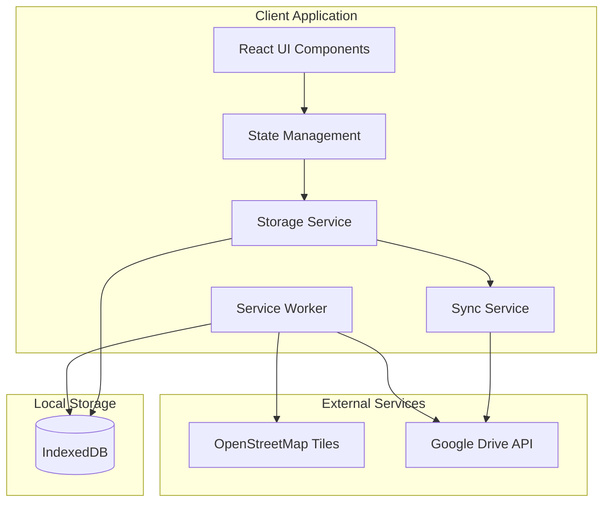
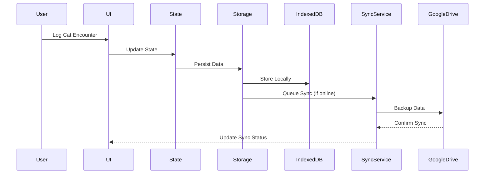

# Design Document

## Overview

CAT-a-log is a Progressive Web App (PWA) built with React and Vite, designed for personal cat encounter tracking. The application follows an offline-first architecture with optional cloud synchronization through Google Drive. The system is deployed on Cloudflare Pages and operates entirely client-side with no backend dependencies beyond Google Drive API integration.

### Key Design Principles

- **Offline-First**: All core functionality works without internet connectivity
- **Progressive Enhancement**: Cloud sync and advanced features enhance but don't block basic usage
- **Minimal Dependencies**: Lightweight tech stack focused on essential functionality
- **Mobile-First**: Responsive design optimized for mobile usage patterns
- **Privacy-Focused**: All data remains under user control with optional cloud backup

## Architecture

### High-Level Architecture



### Data Flow Architecture



## Components and Interfaces

### Core Components

#### 1. App Shell
- **Purpose**: Main application container and routing
- **Responsibilities**: 
  - Initialize PWA features
  - Manage global state providers
  - Handle offline/online status
  - Coordinate service worker registration

#### 2. Map Component
- **Technology**: Leaflet 1.9 with OpenStreetMap tiles
- **Features**:
  - Interactive map with clustering (leaflet.markercluster)
  - Custom paw-shaped pins with color coding
  - Long-press gesture support for mobile
  - Responsive zoom and pan controls
- **Props Interface**:
```typescript
interface MapProps {
  encounters: CatEncounter[];
  onLocationSelect: (lat: number, lng: number) => void;
  onEncounterSelect: (encounter: CatEncounter) => void;
  center?: [number, number];
  zoom?: number;
}
```

#### 3. Encounter Form Modal
- **Purpose**: Data entry interface for cat encounters
- **Features**:
  - Auto-populated date/time with manual override
  - Dropdown selectors for standardized data
  - Photo capture/upload with client-side resizing
  - Form validation and error handling
- **Props Interface**:
```typescript
interface EncounterFormProps {
  isOpen: boolean;
  initialData?: Partial<CatEncounter>;
  location?: { lat: number; lng: number };
  onSave: (encounter: CatEncounter) => void;
  onCancel: () => void;
}
```

#### 4. Encounter Info Card
- **Purpose**: Display encounter details in map popups
- **Features**:
  - Compact encounter summary
  - Photo thumbnail display
  - Inline edit/delete actions
  - Responsive layout for mobile

#### 5. Settings Panel
- **Purpose**: App configuration and data management
- **Features**:
  - Google Drive authentication
  - Manual export/import controls
  - Storage usage indicators
  - Sync status display

### State Management

#### Global State Structure
```typescript
interface AppState {
  encounters: CatEncounter[];
  user: {
    isAuthenticated: boolean;
    googleToken?: string;
    preferences: UserPreferences;
  };
  ui: {
    selectedEncounter?: string;
    mapCenter: [number, number];
    mapZoom: number;
    isFormOpen: boolean;
    syncStatus: 'idle' | 'syncing' | 'error';
  };
}
```

#### State Management Strategy
- **Primary**: React Context with useReducer for complex state
- **Enhancement**: Consider Zustand for performance optimization if needed
- **Persistence**: Automatic sync between state and IndexedDB

### Storage Service Interface

```typescript
interface StorageService {
  // Encounter Management
  saveEncounter(encounter: CatEncounter): Promise<void>;
  getEncounters(): Promise<CatEncounter[]>;
  updateEncounter(id: string, updates: Partial<CatEncounter>): Promise<void>;
  deleteEncounter(id: string): Promise<void>;
  
  // Photo Management
  savePhoto(blob: Blob): Promise<string>; // returns photoBlobId
  getPhoto(photoBlobId: string): Promise<Blob | null>;
  deletePhoto(photoBlobId: string): Promise<void>;
  
  // Data Export/Import
  exportData(): Promise<string>; // JSON string
  importData(jsonData: string): Promise<void>;
  
  // Storage Management
  getStorageUsage(): Promise<{ used: number; quota: number }>;
  clearStorage(): Promise<void>;
}
```

### Sync Service Interface

```typescript
interface SyncService {
  // Authentication
  authenticateGoogle(): Promise<boolean>;
  isAuthenticated(): boolean;
  refreshToken(): Promise<boolean>;
  
  // Data Synchronization
  syncToCloud(): Promise<void>;
  syncFromCloud(): Promise<void>;
  checkCloudData(): Promise<{ lastModified: Date; hasData: boolean }>;
  
  // Conflict Resolution
  resolveConflicts(localData: any, cloudData: any): Promise<any>;
}
```

## Data Models

### Core Data Types

```typescript
// Primary encounter record
export interface CatEncounter {
  id: string;              // UUID v4
  lat: number;             // Latitude coordinate
  lng: number;             // Longitude coordinate
  dateTime: string;        // ISO-8601 timestamp
  catColor: string;        // Standardized color value
  catType: string;         // Standardized type value
  behavior: string;        // Preset or custom behavior
  comment?: string;        // Optional user comment
  photoBlobId?: string;    // Reference to photo in IndexedDB
  createdAt: string;       // ISO-8601 creation timestamp
  updatedAt: string;       // ISO-8601 last update timestamp
}

// Behavior preset configuration
export interface BehaviorPreset {
  id: string;
  label: string;
  isDefault: boolean;
}

// User preferences and settings
export interface UserPreferences {
  defaultMapCenter: [number, number];
  defaultMapZoom: number;
  autoSync: boolean;
  photoQuality: 'low' | 'medium' | 'high';
  theme: 'light' | 'dark' | 'auto';
}

// Sync metadata for conflict resolution
export interface SyncMetadata {
  lastSyncTime: string;
  cloudDataHash: string;
  pendingChanges: string[]; // Array of encounter IDs
}
```

### IndexedDB Schema

```typescript
// Database: cat-a-log-db (version 1)
interface DatabaseSchema {
  encounters: {
    key: string; // encounter.id
    value: CatEncounter;
    indexes: {
      dateTime: string;
      catColor: string;
      catType: string;
    };
  };
  
  photos: {
    key: string; // photoBlobId
    value: Blob;
  };
  
  metadata: {
    key: string; // setting name
    value: any;   // setting value
  };
}
```

### Google Drive Data Format

```typescript
// Stored as cat-a-log/data.json in App Data Folder
interface CloudBackup {
  version: string;
  exportedAt: string;
  encounters: CatEncounter[];
  photos: { [photoBlobId: string]: string }; // Base64 encoded
  preferences: UserPreferences;
  metadata: SyncMetadata;
}
```

## Error Handling

### Error Categories and Responses

#### Storage Errors
- **Quota Exceeded**: Show snackbar warning, suggest photo cleanup
- **IndexedDB Unavailable**: Fallback to localStorage with limited functionality
- **Corruption**: Attempt recovery, offer data export before reset

#### Network Errors
- **Offline State**: Queue operations, show offline indicator
- **API Rate Limits**: Implement exponential backoff
- **Authentication Failures**: Silent refresh, prompt re-auth if needed

#### Data Conflicts
- **Timestamp Resolution**: Use `updatedAt` field for automatic resolution
- **Manual Resolution**: Present conflict UI for user decision
- **Merge Strategies**: Combine non-conflicting changes when possible

### Error Handling Implementation

```typescript
interface ErrorHandler {
  handleStorageError(error: StorageError): void;
  handleNetworkError(error: NetworkError): void;
  handleSyncConflict(conflict: DataConflict): Promise<Resolution>;
  showUserMessage(message: string, type: 'info' | 'warning' | 'error'): void;
}
```

## Testing Strategy

### Unit Testing
- **Components**: React Testing Library for UI components
- **Services**: Jest for storage and sync service logic
- **Utilities**: Pure function testing for data transformations
- **Coverage Target**: 80% code coverage minimum

### Integration Testing
- **Storage Operations**: Test IndexedDB interactions
- **PWA Features**: Service worker and offline functionality
- **Google Drive Integration**: Mock API responses and error conditions

### End-to-End Testing
- **User Flows**: Critical path testing with Playwright
- **Cross-Browser**: Chrome, Firefox, Safari testing
- **Mobile Testing**: Responsive design and touch interactions
- **Offline Scenarios**: Network disconnection simulation

### Performance Testing
- **Bundle Size**: Monitor and optimize JavaScript bundle
- **Runtime Performance**: Memory usage and rendering performance
- **Storage Performance**: IndexedDB operation benchmarks
- **Network Efficiency**: API call optimization and caching

### Testing Data Setup

```typescript
// Test fixtures and mock data
interface TestFixtures {
  mockEncounters: CatEncounter[];
  mockPhotos: { [id: string]: Blob };
  mockGoogleResponses: any[];
  mockGeolocation: { lat: number; lng: number };
}
```

## Security Considerations

### Data Protection
- **Local Storage**: IndexedDB provides origin isolation
- **Photo Privacy**: Images stored locally, only synced with explicit consent
- **API Keys**: No hardcoded secrets, OAuth tokens stored securely

### Authentication Security
- **OAuth 2 PKCE**: Secure authentication flow for Google Drive
- **Token Management**: Automatic refresh with secure storage
- **Scope Limitation**: Minimal required permissions (Drive App Data only)

### Content Security Policy
```
default-src 'self';
script-src 'self' 'unsafe-inline';
style-src 'self' 'unsafe-inline';
img-src 'self' data: blob: https://*.openstreetmap.org;
connect-src 'self' https://www.googleapis.com https://*.openstreetmap.org;
```

## Performance Optimization

### Bundle Optimization
- **Code Splitting**: Lazy load non-critical components
- **Tree Shaking**: Remove unused dependencies
- **Asset Optimization**: Compress images and minimize CSS

### Runtime Performance
- **Virtual Scrolling**: For large encounter lists
- **Image Lazy Loading**: Defer photo loading until needed
- **Map Clustering**: Reduce DOM nodes for better performance
- **Debounced Operations**: Batch sync operations and user input

### Caching Strategy
- **Service Worker**: Implement Workbox caching strategies
- **Static Assets**: Cache-first for app shell
- **Map Tiles**: Stale-while-revalidate for map data
- **API Responses**: Network-first with fallback for Drive API

## Deployment Architecture

### Build Process
1. **TypeScript Compilation**: Type checking and transpilation
2. **Vite Build**: Bundle optimization and asset processing
3. **PWA Generation**: Manifest and service worker creation
4. **Cloudflare Pages**: Static site deployment

### Environment Configuration
- **Development**: Local Vite dev server with hot reload
- **Preview**: Production build with local preview
- **Production**: Cloudflare Pages with global CDN

### Monitoring and Analytics
- **Error Tracking**: Client-side error reporting
- **Performance Metrics**: Core Web Vitals monitoring
- **Usage Analytics**: Privacy-respecting usage statistics
- **Sync Health**: Monitor backup success rates